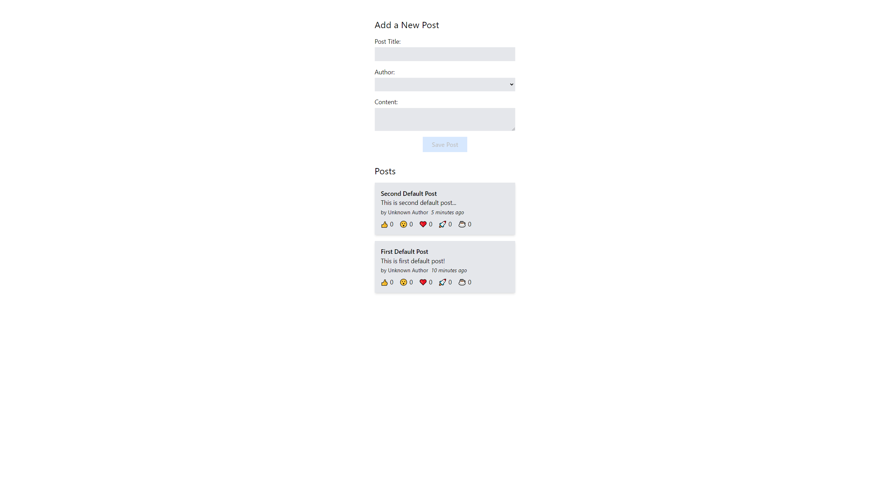

 

  <h1 align="center">Redux Post App</h1>

## About Project

Basic app used to operate added posts, all operations are handled by <b>Redux</b>. Website is built using React JS, TypeScript and designed using Tailwind CSS.

## Screenshots

## Tech Stack

- 
- 
- 
- 
